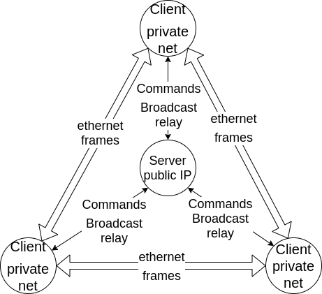

[English](README_en.md)
# 什么是ntVPN（NAT traversal P2P VPN）
ntVPN是一款具有内网穿透能力的VPN。可以完成多个无公网IP的私网组网，主要应用于远程办公环境，支持远程桌面，
文件共享、k8s集群部署等应用场景。
除以下两种特殊情况外，节点之间的流量不必经过服务端转发， 可以极大节约服务端的带宽。
- ARP，DHCP等需要在以太网发送广播的协议由服务端转发，
- P2P通信失败时，可以打开服务端转发功能。可进行带宽、流量配额的配置。

本项目将在初步开发完成后部署一个公共的服务端，帮助没有公网服务器的朋友完成多个私网的组网。

ntVPN项目目前正在开发中，还没有可以稳定使用的版本。

# ntVPN的部署
ntVPN由服务端及客户端组成，如图所示：

服务端部署在公网环境，提供以下能力：
- 辅助完成内网穿透
- 传递VPN网络中的的以太网广播
- 按配置在节点间P2P通信失败时进行通信中继
- VPN网络管理
  - 中继带宽、流量限额的管理
  - VPN节点管理

客户端部署在内网环境，提供以下能力：
- 节点虚拟网卡的配置及管理
- 节点路由表配置，IP forward配置（Linux）
- 基于节点间P2P通信完成各节点虚拟网卡的组网
- 在P2P通信失败时使用服务端的中继能力进行组网

（此处为部署示例，将在原型开发完成后更新）

# ntVPN的特点
ntVPN主要应用于多个无公网IP的私网组网的场景。主要解决痛点为：
传统VPN（如OpenVPN）流量需要服务端转发，对服务端带宽要求高的问题。
（云服务器的固定带宽太贵，按量付费需要支付额外￥0.8/Gb的流量费）

P2P方式工作的VPN已有[n2n](https://github.com/ntop/n2n) 等优秀的项目。
本人也有幸为n2n贡献了一些流量过滤方面的代码(
[#489](https://github.com/ntop/n2n/pull/489),
[#499](https://github.com/ntop/n2n/pull/499)) 
但该项目在p2p通信失败时自动使用服务端进行转发。没有带宽，流量配额等方面的配置，
容易在不知不觉间使用大量流量，支付不少云服务器流量费。
该项目使用C语言开发，添加这些功能相对比较繁琐。

ntVPN与n2n的主要区别在于：
ntVPN将提供Web的管理界面，并为用户提供转发策略，节点管理等配置。

ntVPN不适用于科学上网等远程服务器已有公网IP的场景，请勿将本软件应用于科学上网。

# ntVPN的技术栈
ntVPN使用如下技术栈：
- [rpcx](https://github.com/smallnest/rpcx) 用于开发服务端RPC，并提供向客户端进行消息推送的能力
- [pion/ice](https://github.com/pion/ice) 用于UDP打洞，节点间的p2p通信
- [mdlayher/ethernet](https://github.com/mdlayher/ethernet) 用于以太网数据帧的解析

# 帮助ntVPN

你可以通过以下方式帮助ntVPN
    
    更新已有的Issue或者提出新的Issue
    提出新的功能特性
    完善ntVPN的文档
    为ntVPN提交pull request

